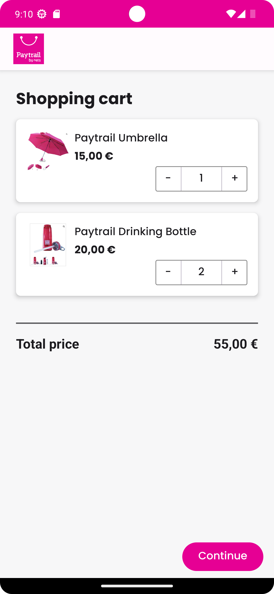
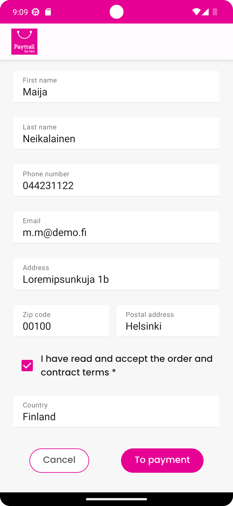
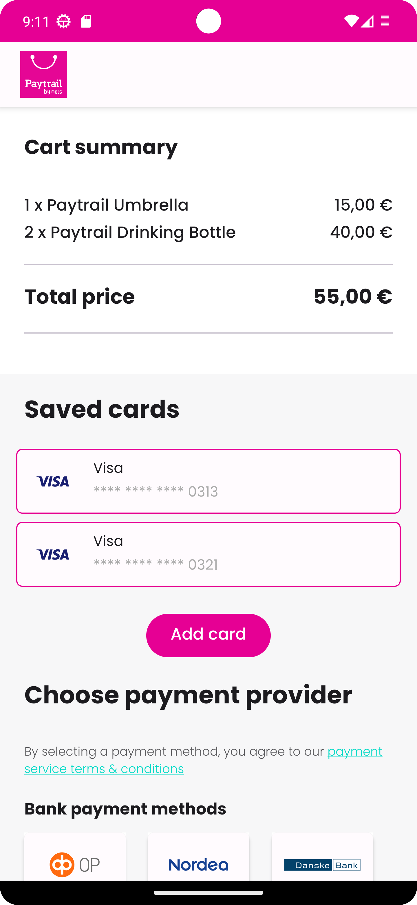
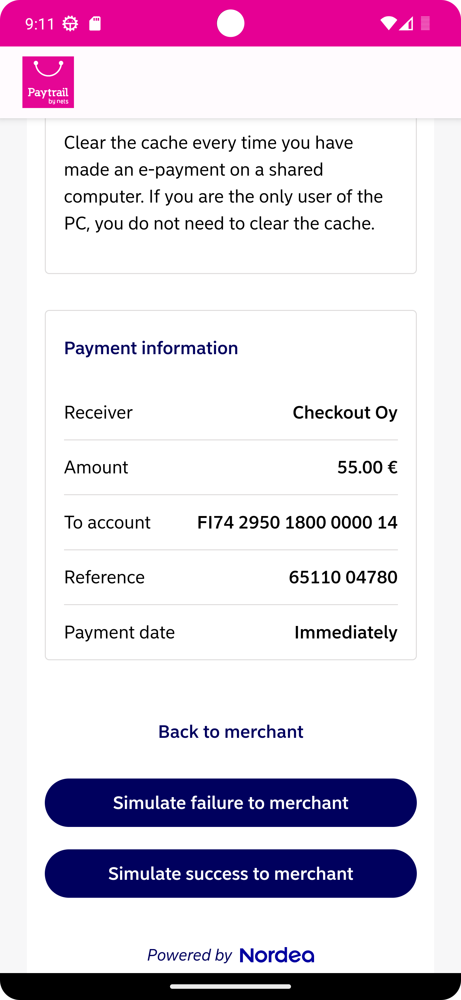

# 🛍️ Paytrail Android SDK Demo

This repository hosts a simple shopping demo app developed using Kotlin and Jetpack Compose to showcase the capabilities of the Paytrail SDK for Android.

**Paytrail** offers seamless transaction experiences, and this demo is designed to provide a hands-on understanding of how developers can integrate and benefit from the Paytrail ecosystem.

## 🚀 Features

- 🔍 **Customer Details**: Gather all the necessary customer details.
- 🚫 **Payment Request**: Kick-off the payment request.
- 💳 **Payment Providers**: Showcase all available payment providers.
- 📥 **Adding a Card**: Let your users save their card details.
- ✅ **Payment Flows**: Handle both success and failure scenarios.
- ⏳ **Payment State**: Efficiently process the current state of the payment.

**Note**: 📌 The dataset used in this demo is entirely static. Dive into `ShoppingCartRepository.kt` for insights.

## 🖼️ Screenshots

<div style="display: flex; justify-content: space-between;">
    
    
    
    
    
</div>


## 🚀 Getting Started

### 🛠️ Prerequisites
- 📱 Android Studio version >= Android studio Giraffe.
- 🧰 Compile SDK: Version 34.
- 🎯 Target SDK: Version 33.

### 🔧 Installation

1. 📥 Clone the `paytrail-android-sdk` repository.
2. 📂 Open the project in Android Studio.
3. ▶️ Select `demo-app` from the Run configuration menu.

## 📖 Documentation
For an in-depth guide on the capabilities of the Paytrail SDK, refer to our [official documentation](https://docs.paytrail.com/#/) .

## 📥 Get the Demo APK
Download our demo APK to see the SDK in action on your device!
👉 [Download Demo APK](https://github.com/paytrail/paytrail-android-sdk/release/demo-app-release.apk)

## 📜 License
```
MIT License

Copyright (c) 2023 Paytrail

Permission is hereby granted, free of charge, to any person obtaining a copy
of this software and associated documentation files (the "Software"), to deal
in the Software without restriction, including without limitation the rights
to use, copy, modify, merge, publish, distribute, sublicense, and/or sell
copies of the Software, and to permit persons to whom the Software is
furnished to do so, subject to the following conditions:

The above copyright notice and this permission notice shall be included in all
copies or substantial portions of the Software.

THE SOFTWARE IS PROVIDED "AS IS", WITHOUT WARRANTY OF ANY KIND, EXPRESS OR
IMPLIED, INCLUDING BUT NOT LIMITED TO THE WARRANTIES OF MERCHANTABILITY,
FITNESS FOR A PARTICULAR PURPOSE AND NONINFRINGEMENT. IN NO EVENT SHALL THE
AUTHORS OR COPYRIGHT HOLDERS BE LIABLE FOR ANY CLAIM, DAMAGES OR OTHER
LIABILITY, WHETHER IN AN ACTION OF CONTRACT, TORT OR OTHERWISE, ARISING FROM,
OUT OF OR IN CONNECTION WITH THE SOFTWARE OR THE USE OR OTHER DEALINGS IN THE
SOFTWARE.
```